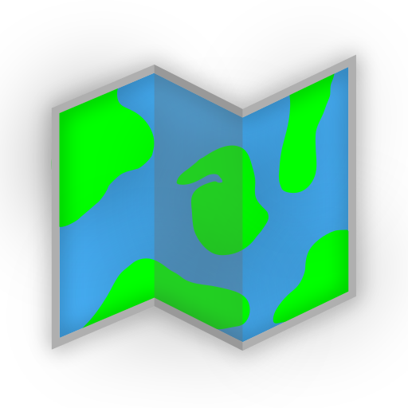
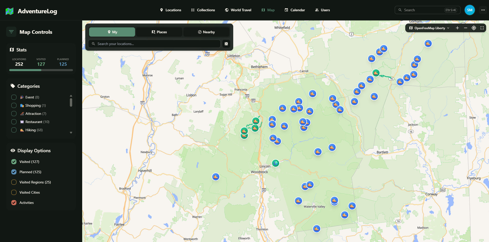
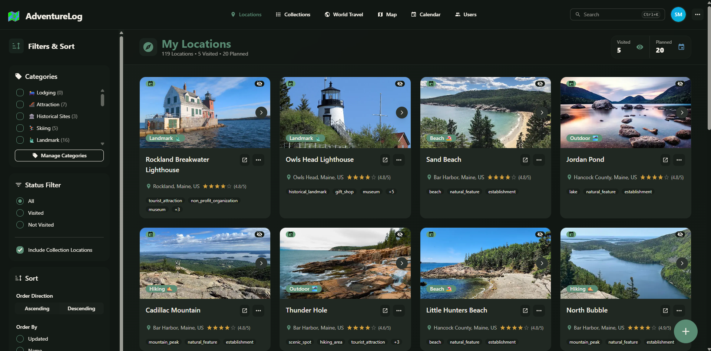
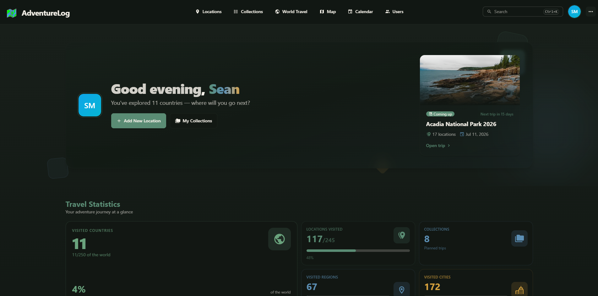
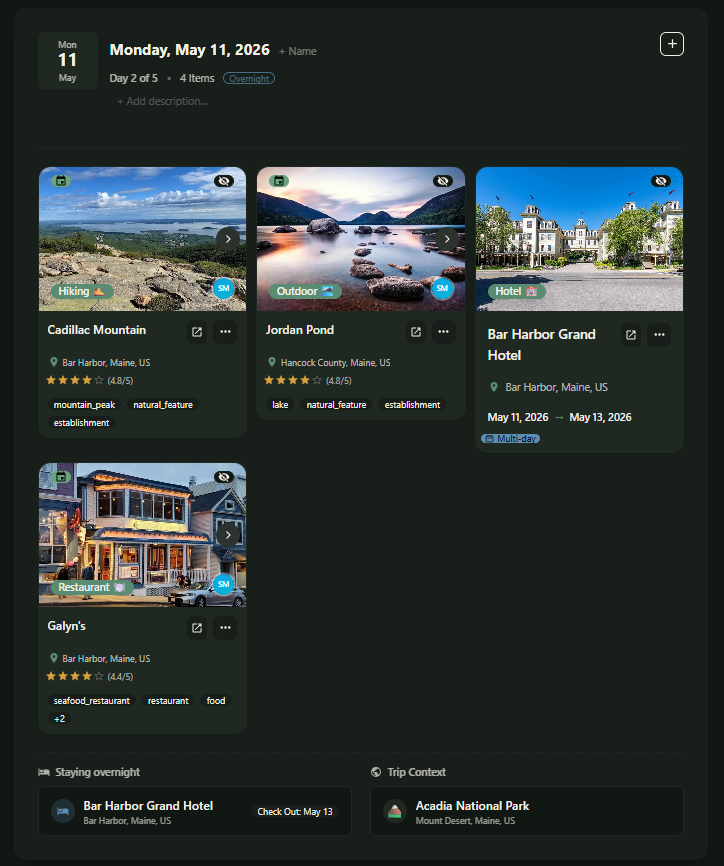
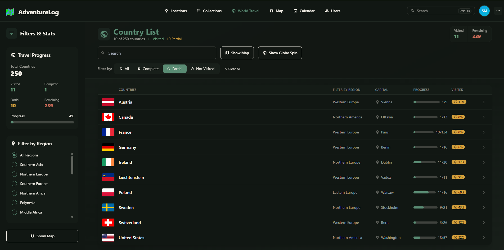
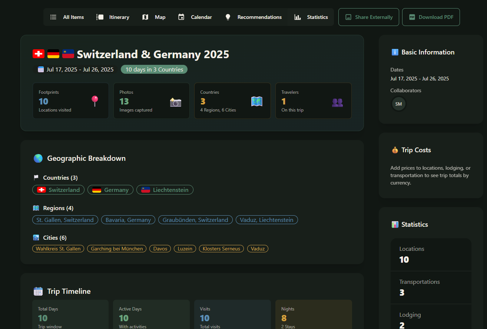
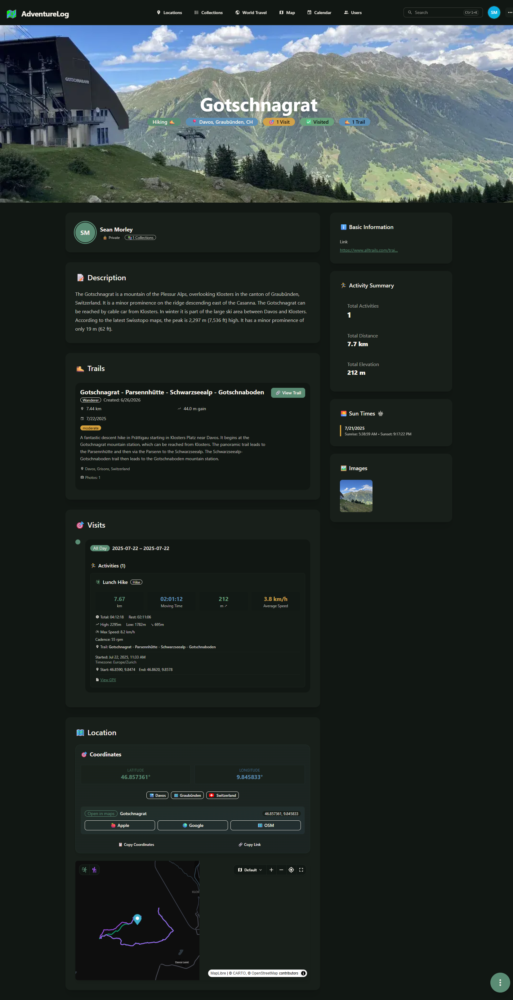
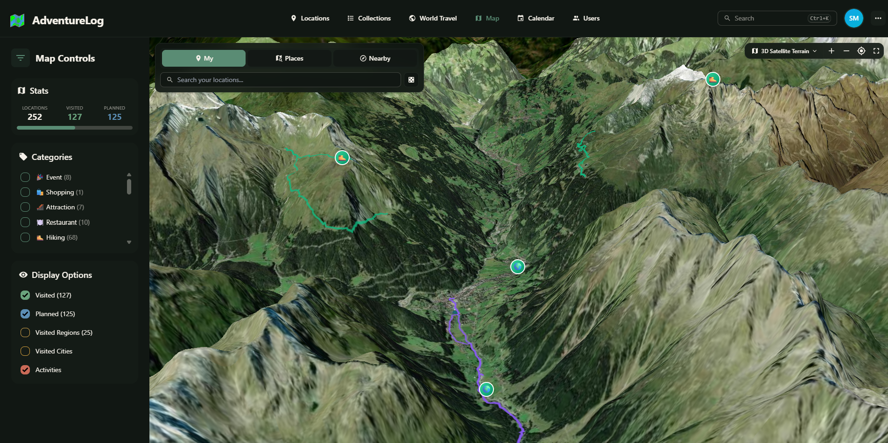
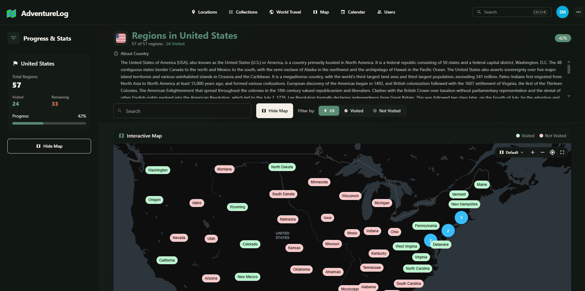

<div align="center">



# AdventureLog

**The ultimate travel companion — log where you've been, plan what's next, and see your whole world on one map.**

[](LICENSE)
[](https://adventurelog.app/docs/install/getting_started.html)
[](https://adventurelog.app/docs/install/getting_started.html)
[](https://discord.gg/wRbQ9Egr8C)
[](https://github.com/seanmorley15/AdventureLog/stargazers)

[Live Demo](https://demo.adventurelog.app) · [**Get Started**](https://adventurelog.app/docs/install/getting_started.html) · [Quick Install](#quick-start) · [Documentation](https://adventurelog.app) · [Discord](https://discord.gg/wRbQ9Egr8C) · [Support the project](https://seanmorley.com/sponsor)

<br />

<table>
  <tr>
    <td align="center" width="25%">
      <strong>📍 Log travel experiences</strong><br />
      Locations, visits, photos, trails &amp; activities
    </td>
    <td align="center" width="25%">
      <strong>✈️ Plan trips</strong><br />
      Itineraries, checklists, calendar &amp; shared planning
    </td>
    <td align="center" width="25%">
      <strong>🌍 Track the world</strong><br />
      Countries, regions, cities &amp; travel stats
    </td>
    <td align="center" width="25%">
      <strong>🔒 Own your data</strong><br />
      Open source, self-hosted, GPL-3.0
    </td>
  </tr>
</table>

</div>

<br />

## What is AdventureLog?

AdventureLog is a **modern open-source travel companion**. Pin every place you've visited, build multi-day trip itineraries, mark countries and regions on an interactive world map, and collaborate with the people you travel with. It integrates with your existing tools and services to help you plan your next unforgettable adventure.

Built for travelers who want to track, plan, and remember their travel experiences.

## See it in action

<p align="center">
  
  <br />
  <em>Interactive world map — every location, visit status, and filter at a glance</em>
</p>

<table>
  <tr>
    <td width="50%" align="center">
      
      <br />
      <strong>Locations</strong> — browse, filter, categorize &amp; organize
    </td>
    <td width="50%" align="center">
      
      <br />
      <strong>Dashboard</strong> — travel stats, progress &amp; milestones
    </td>
  </tr>
</table>

<p align="center">
  
  <br />
  <strong>Trip planning</strong> — itineraries, notes &amp; daily activities
</p>

<table>
  <tr>
    <td width="50%" align="center">
      
      <br />
      <strong>World travel</strong> — countries, regions &amp; cities
    </td>
    <td width="50%" align="center">
      
      <br />
      <strong>Trip stats</strong> — costs, geography &amp; per-trip milestones
    </td>
  </tr>
</table>

<details>
<summary><strong>More screenshots</strong></summary>
<br />

<p align="center">
  
  <br /><em>Rich location details — dates, notes, ratings &amp; visit history</em>
</p>

<p align="center">
  
  <br /><em>3D satellite view — explore your travel history immersively</em>
</p>

<p align="center">
  
  <br /><em>Regions — drill into states, provinces &amp; territories</em>
</p>

</details>

## Features

| | Feature | What you get |
| --- | --- | --- |
| 📍 | **Locations & visits** | Pin places on the map with dates, notes, photos, categories, tags, and multi-visit history |
| 🗺️ | **Interactive map** | Filter by visited / planned, add locations by click, 2D & 3D views |
| ✈️ | **Trip itineraries** | Multi-day collections with flights, lodging, checklists, links & calendar views |
| 🤝 | **Collaboration** | Share locations and itineraries via public links or invite other users to edit together |
| 🌍 | **World travel book** | Track countries, regions, and cities — with stats and progress milestones |
| 🥾 | **Trails & activities** | Attach hiking routes, GPX tracks, distance, elevation & outdoor activity logs |
| 🔍 | **Search & organize** | Full-text search, custom categories, public/private visibility |
| 🔐 | **Security** | MFA, API keys, social auth (Google, GitHub, Authelia & more) |

### Integrations

Connect the tools you already use:

| Integration | Purpose |
| ----------- | ------- |
| [**Immich**](https://adventurelog.app/docs/configuration/immich_integration.html) | Link photos from your self-hosted media library |
| [**Strava**](https://adventurelog.app/docs/configuration/strava_integration.html) | Import activities with GPX tracks & stats |
| [**Endurain**](https://adventurelog.app/docs/configuration/endurain_integration.html) | Import activities with GPX tracks & stats |
| [**Wanderer**](https://adventurelog.app/docs/configuration/wanderer_integration.html) | Attach trails with distance & elevation data |
| [**Google Maps**](https://adventurelog.app/docs/configuration/google_maps_integration.html) | Geocoding & location search |

## Why AdventureLog?

| | **AdventureLog** | Typical closed travel apps |
| --- | --- | --- |
| **Ownership** | Your data on your server | Locked in a vendor cloud |
| **Cost** | Free to self-host (GPL-3.0) | Subscriptions & upsells |
| **Privacy** | You control access & sharing | Opaque data policies |
| **Customization** | Open source — extend & integrate | Fixed feature set |
| **Scope** | Locations, itineraries & world travel in one app | Split across multiple tools |

## Quick start

Not sure which setup fits you? The **[Getting Started guide](https://adventurelog.app/docs/install/getting_started.html)** covers every install path — Docker, homelab NAS, Kubernetes, reverse proxies, and more.

The fastest way to get running — one container, one port:

```bash
curl -sSL https://get.adventurelog.app | bash
```

Or follow the [Standard Deployment guide](https://adventurelog.app/docs/install/standard.html) for Docker Compose.

**Requirements:** Docker Engine + Compose v2 · 2 GB RAM on first boot · Linux, VPS, homelab, or macOS

| I want to… | Guide |
| ---------- | ----- |
| See all install options | [**Getting Started**](https://adventurelog.app/docs/install/getting_started.html) |
| Try before installing | [Live demo](https://demo.adventurelog.app) |
| One-command install | [Quick Start Installer](https://adventurelog.app/docs/install/quick_start.html) |
| Deploy on Proxmox / Synology / Unraid | [Platform guides](https://adventurelog.app/docs/install/getting_started.html) |
| Run on Kubernetes | [Kustomize guide](https://adventurelog.app/docs/install/kustomize.html) |
| Learn the app | [Usage guide](https://adventurelog.app/docs/usage/usage.html) |

> Default login is `admin` / `admin` — it's recommended to change it immediately after first sign-in.

## Tech stack

<details>
<summary><strong>Frontend</strong></summary>

- [SvelteKit](https://svelte.dev/)
- [Tailwind CSS](https://tailwindcss.com/) + [DaisyUI](https://daisyui.com/)
- [Svelte MapLibre](https://github.com/dimfeld/svelte-maplibre/) (MapLibre GL)

</details>

<details>
<summary><strong>Backend</strong></summary>

- [Django](https://www.djangoproject.com/) + [Django REST Framework](https://www.django-rest-framework.org/)
- [PostGIS](https://postgis.net/) / PostgreSQL
- [AllAuth](https://allauth.org/)

</details>

<details>
<summary><strong>Deployment</strong></summary>

- Docker & Docker Compose (recommended)
- Kubernetes (Kustomize)
- Reverse proxy guides for [Nginx](https://adventurelog.app/docs/install/nginx_proxy_manager.html), [Traefik](https://adventurelog.app/docs/install/traefik.html) & [Caddy](https://adventurelog.app/docs/install/caddy.html)

</details>

## Roadmap

Track what's coming next on the [public roadmap →](https://github.com/users/seanmorley15/projects/5)

## Contributing

Contributions are welcome! See [`CONTRIBUTING.md`](CONTRIBUTING.md) to get started.

<a href="https://github.com/seanmorley15/AdventureLog/graphs/contributors">
  
</a>

### Translation

Help translate AdventureLog on [Weblate](https://hosted.weblate.org/projects/adventurelog/):

<a href="https://hosted.weblate.org/engage/adventurelog/">
  
</a>

## License

Distributed under the [GNU General Public License v3.0](LICENSE).

## About the creator

**[Sean Morley](https://seanmorley.com)** — I'm an Electrical Engineering student at UConn, an open-source developer, and an avid traveler. AdventureLog started as my simple idea to track where I've been and grew into a full travel companion built for people who love exploring the world. I'm passionate about open-source software and building tools that solve real problems for real people. **Feel free to reach out to me directly via the info on my website if you have any questions or feedback! :)**

Want the full origin story? Read the [Development Timeline](https://adventurelog.app/docs/changelogs/development_timeline.html).

## Acknowledgements

- Logo design by [nordtektiger](https://github.com/nordtektiger)
- World geography data from [dr5hn/countries-states-cities-database](https://github.com/dr5hn/countries-states-cities-database)

## Supporters

AdventureLog is built and maintained as an open-source project. These supporters help make continued development possible.

### Individual supporters

Huge thanks to Veymax, [Mathias Ponnwitz](https://github.com/Solution-Partner-Mathias-Ponnwitz), [nebriv](https://github.com/nebriv), [Miguel Cruz](https://github.com/Tokynet), and [Victor Butler](https://x.com/victor_butler).

### Become a supporter

Your support funds new features, infrastructure, and continued open-source development.

**[Become a Sponsor →](https://seanmorley.com/sponsor)**

<div align="center">

**Happy travels!**

[⭐ Star us on GitHub](https://github.com/seanmorley15/AdventureLog/stargazers) · [Get Started](https://adventurelog.app/docs/install/getting_started.html) · [Report a bug](https://github.com/seanmorley15/AdventureLog/issues) · [Join Discord](https://discord.gg/wRbQ9Egr8C)

</div>
