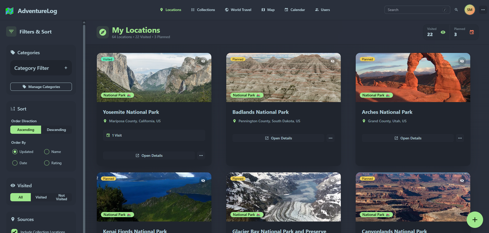
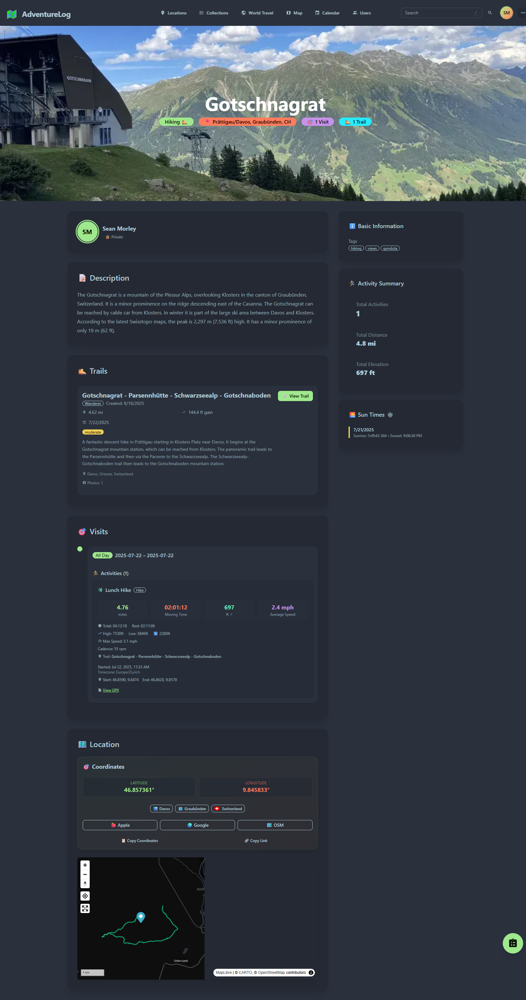
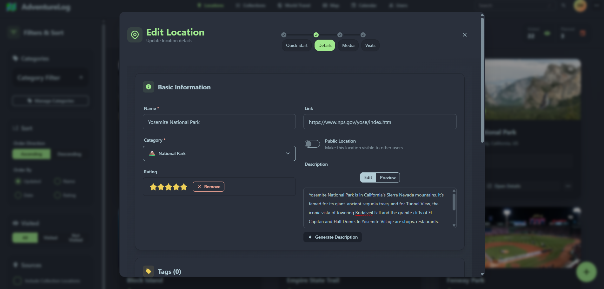
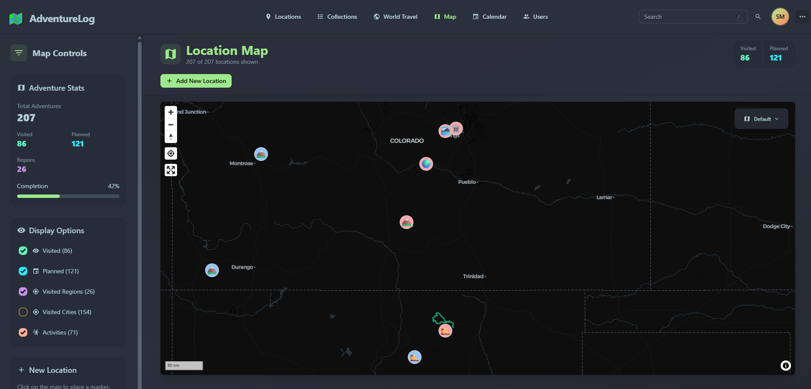
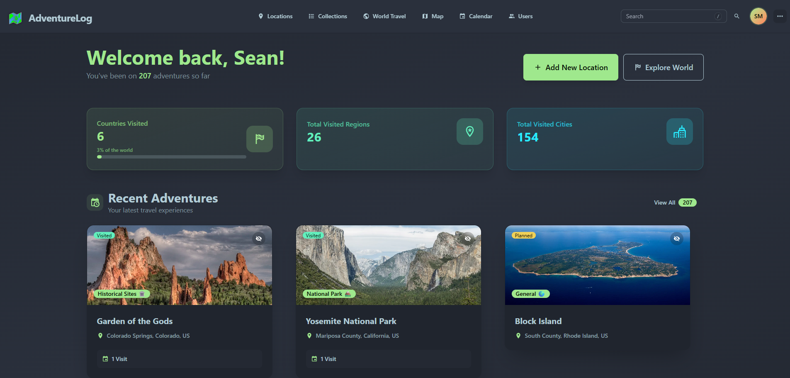
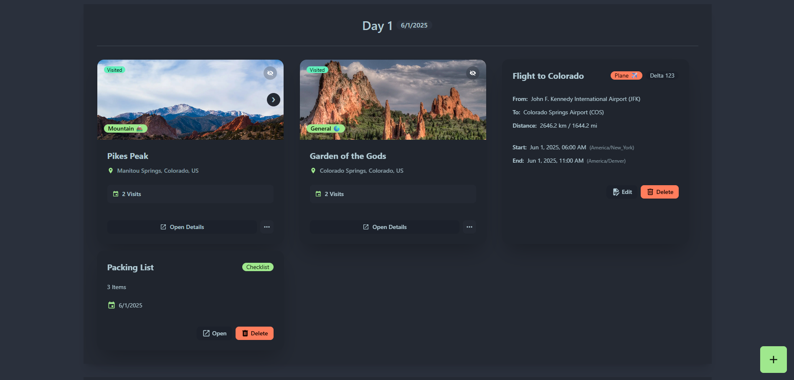
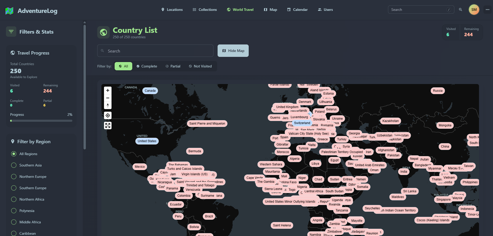
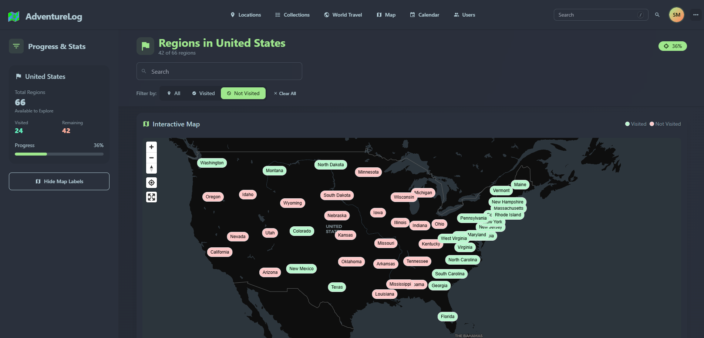

  
  <h1>AdventureLog</h1>
  
  

    The ultimate travel companion for the modern-day explorer.
  

   
<h4>
    <a href="https://demo.adventurelog.app">View Demo</a>
   · 
    <a href="https://demo.adventurelog.app">Documentation</a>
   · 
    <a href="https://github.com/seanmorley15/AdventureLog/issues/new/choose">Discord</a>
   · 
    <a href="https://buymeacoffee.com/seanmorley15">Support 💖</a>
  </h4>

 

<!-- Table of Contents -->

# Table of Contents

- [About the Project](#-about-the-project)
  - [Screenshots](#-screenshots)
  - [Tech Stack](#-tech-stack)
  - [Features](#-features)
- [Roadmap](#-roadmap)
- [Contributing](#-contributing)
- [License](#-license)
- [Contact](#-contact)
- [Acknowledgements](#-acknowledgements)

<!-- About the Project -->

## ⭐ About the Project

Starting from a simple idea of tracking travel locations (called adventures), AdventureLog has grown into a full-fledged travel companion. With AdventureLog, you can log your adventures, keep track of where you've been on the world map, plan your next trip collaboratively, and share your experiences with friends and family.

AdventureLog was created to solve a problem: the lack of a modern, open-source, user-friendly travel companion. Many existing travel apps are either too complex, too expensive, or too closed-off to be useful for the average traveler. AdventureLog aims to be the opposite: simple, beautiful, and open to everyone.

<!-- Screenshots -->

### 📷 Screenshots

 
  
  
Displays the adventures you have visited and the ones you plan to embark on. You can also filter and sort the adventures.

  
  
Shows specific details about an adventure, including the name, date, location, description, and rating.

  
  
  
View all of your adventures on a map, with the ability to filter by visit status and add new ones by click on the map

  
  
Displays a summary of your adventures, including your world travel stats.

  
  
Plan your adventures and travel itinerary with a list of activities and a map view. View your trip in a variety of ways, including an itinerary list, a map view, and a calendar view.

  
  
Lists all the countries you have visited and plan to visit, with the ability to filter by visit status.

  
  
Displays the regions for a specific country, includes a map view to visually select regions.

<!-- TechStack -->

### 🚀 Tech Stack

  
Client

  <ul>
    <li><a href="https://svelte.dev/">SvelteKit</a></li>
    <li><a href="https://tailwindcss.com/">TailwindCSS</a></li>
    <li><a href="https://daisyui.com/">DaisyUI</a></li>
    <li><a href="https://github.com/dimfeld/svelte-maplibre/">Svelte MapLibre</a></li>
  </ul>

  
Server

  <ul>
    <li><a href="https://www.djangoproject.com/">Django</a></li>
    <li><a href="https://postgis.net/">PostGIS</a></li>
    <li><a href="https://www.django-rest-framework.org/">Django REST Framework</a></li>
    <li><a href="https://allauth.org/">AllAuth</a></li>
  </ul>

<!-- Features -->

### 🎯 Features

- **Track Your Adventures** 🌍: Log your adventures and keep track of where you've been on the world map.
  - Adventures can store a variety of information, including the location, date, and description.
  - Adventures can be sorted into custom categories for easy organization.
  - Adventures can be marked as private or public, allowing you to share your adventures with friends and family.
  - Keep track of the countries and regions you've visited with the world travel book.
- **Plan Your Next Trip** 📃: Take the guesswork out of planning your next adventure with an easy-to-use itinerary planner.
  - Itineraries can be created for any number of days and can include multiple destinations.
  - Itineraries include many planning features like flight information, notes, checklists, and links to external resources.
  - Itineraries can be shared with friends and family for collaborative planning.
- **Share Your Experiences** 📸: Share your adventures with friends and family and collaborate on trips together.
  - Adventures and itineraries can be shared via a public link or directly with other AdventureLog users.
  - Collaborators can view and edit shared itineraries (collections), making planning a breeze.

<!-- Roadmap -->

## 🧭 Roadmap

The AdventureLog Roadmap can be found [here](https://github.com/users/seanmorley15/projects/5)

<!-- Contributing -->

## 👋 Contributing

Contributions are always welcome!

See `contributing.md` for ways to get started.

<!-- License -->

## 📃 License

Distributed under the GNU General Public License v3.0. See `LICENSE` for more information.

<!-- Contact -->

## 🤝 Contact

Sean Morley - [website](https://seanmorley.com)

Hi! I'm Sean, the creator of AdventureLog. I'm a college student and software developer with a passion for travel and adventure. I created AdventureLog to help people like me document their adventures and plan new ones effortlessly. As a student, I am always looking for more opportunities to learn and grow, so feel free to reach out via the contact on my website if you would like to collaborate or chat!

<!-- Acknowledgments -->

## 💎 Acknowledgements

- Logo Design by [nordtechtiger](https://github.com/nordtechtiger)
- WorldTravel Dataset [dr5hn/countries-states-cities-database](https://github.com/dr5hn/countries-states-cities-database)
