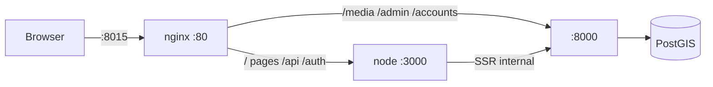

# All-in-One (AIO) Docker

The AIO setup bundles the SvelteKit frontend and Django backend into **one container** on a **single port**. No separate backend URL, no reverse proxy required for basic use.

The standard [multi-container Docker setup](docker.md) remains available for users who prefer separate frontend/backend services or advanced configurations.

## When to use AIO

| AIO | Standard compose |
|-----|------------------|
| One URL, one port | Two ports (frontend + backend) |
| Two env vars to start | Full `.env` configuration |
| Good for homelabs and quick installs | Good for advanced / split deployments |

## Quick start

**Recommended:** use the [quick start installer](quick_start.md):

```bash
curl -sSL https://get.adventurelog.app | bash
```

Or manually:

```bash
wget https://raw.githubusercontent.com/seanmorley15/AdventureLog/main/docker-compose.aio.yml
wget https://raw.githubusercontent.com/seanmorley15/AdventureLog/main/.env.aio.example
cp .env.aio.example .env.aio
docker compose --env-file .env.aio -f docker-compose.aio.yml up -d
```

Open **http://localhost:8015** (or your configured `SITE_URL`).

**Memory:** allocate at least **2 GB RAM** on first boot; about **1 GB** is usually enough afterward. See [`docker-compose.override.example.yml`](https://github.com/seanmorley15/AdventureLog/blob/main/docker-compose.override.example.yml) for optional resource limits.

Default admin login: `admin` / `admin` — change this after first login.

## Configuration

Only **two variables** are required in `.env.aio`:

| Variable | Required | Description | Default |
|----------|----------|-------------|---------|
| `POSTGRES_PASSWORD` | Yes | Database password | — |
| `SITE_URL` | No | Public URL for the app | `http://localhost:8015` |

Optional:

| Variable | Description | Default |
|----------|-------------|---------|
| `HOST_PORT` | Host port mapped to the container | `8015` |

Everything else (Django `SECRET_KEY`, `CSRF_TRUSTED_ORIGINS`, `PUBLIC_URL`, `FRONTEND_URL`, `ORIGIN`, internal `PUBLIC_SERVER_URL`, etc.) is derived automatically at startup.

::: tip Image size
The AIO image is ~1 GB (PostGIS/GDAL + Python + Node). It must **not** include local dev folders such as `backend/server/media/` or `.venv` — those are excluded via [`.dockerignore`](https://github.com/seanmorley15/AdventureLog/blob/main/.dockerignore). If your built image is ~3 GB, rebuild from a clean checkout without baking in local media.
:::

### Example `.env.aio`

```env
POSTGRES_PASSWORD=my-secure-db-password
SITE_URL=https://adventurelog.example.com
HOST_PORT=443
```

When using HTTPS behind an external reverse proxy, set `SITE_URL` to your public HTTPS URL and proxy traffic to the AIO container port.

## How it works



Inside the AIO container, nginx routes browser traffic:

- **Frontend** (SvelteKit): all app pages, `/api`, `/auth`, `/health`
- **Backend** (Gunicorn): `/media`, `/admin`, `/accounts`, `/static`

The database runs in a separate container (same as the standard setup).

## Updating

```bash
docker compose --env-file .env.aio -f docker-compose.aio.yml pull
docker compose --env-file .env.aio -f docker-compose.aio.yml up -d --wait
```

## Image

Prebuilt image: `ghcr.io/seanmorley15/adventurelog-aio:latest`

To build locally from source:

```bash
docker build -f docker/Dockerfile --target aio -t adventurelog-aio .
# or
docker compose --env-file .env.aio -f docker-compose.aio.yml build
```

See [`docker/README.md`](https://github.com/seanmorley15/AdventureLog/blob/main/docker/README.md) for all build targets.

## Operations

- [Operations & Maintenance](../configuration/operations.md) — backups, updates, management menu
- [Environment Variables](../configuration/environment_variables.md) — full reference including optional S3, OAuth, and email settings

Advanced options can be added to `.env.aio` or the `environment` block in `docker-compose.aio.yml`.
